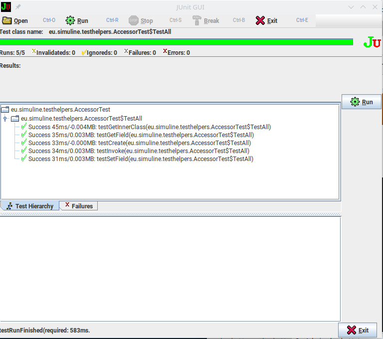

<!-- markdownlint-disable no-trailing-spaces -->
<!-- markdownlint-disable no-inline-html -->
# The Package `Testhelpers`

This package offers elementary classes which proved useful 
for tests of software made at simuline (www.simuline.eu).
For further pieces of information see the 
[homepage](http://www.simuline.eu/TestHelpers/index.html) 
hosted at [GitHub](https://github.com/Reissner/TestHelpers). 

The functionality is quite inhomogeneous: 

- an accessor class for white-box-tests,
- a static class providing specialized assertions,
- a [GUI](#notes-on-the-gui) to run tests and test suites selectively and interactively

Although most of the classes are outdated if using new junit5
in combination with modern IDEs,
the `testhelpers` are still used at (www.simuline.eu). 
This is because it is quite responsive and reaches stability 
modern IDEs not always have. 
There is even a [Backlog](#backlog) planing further development. 


Originally, the GUI filled the gap for the IDE given by the GNU Emacs plugin `JDEE`.
The assertions class provided completed the assertions offered by junit4.
Solely the accessor seems really up-to-date at the time of this writing.

Anyway, if you want, feel free to use this piece of software.

## Notes on the GUI <a id='ssGUI'></a>

The GUI is intended to be used in a maven project.
To that end, just place [runTest.sh](./runTest.sh) in the root directory of the project
(where your `pom.xml` resides)
and make sure that in the pom something like the following can be found 

```[xml]
<project...>
  ...
  <build>
    ...
    <plugins>
      ...
      <plugin>
        <groupId>org.apache.maven.plugins</groupId>
  <artifactId>maven-dependency-plugin</artifactId>
  <version>3.0.2</version>
  <executions>
    <execution>
      <goals>
        <goal>build-classpath</goal>
      </goals>
      <configuration>
        <outputFile>${project.build.directory}/classpath.txt</outputFile>
      </configuration>
    </execution>
          ...
  </executions>
      </plugin>
      ...
   <plugins>
    ...
  <build>
</project>
 ```

Then run maven pass lifecycle phase `generate-sources`,
most naturally by 

```[sh]
mvn generate-sources
```

As a result, in the target folder the file `classpath.txt` appears
containing the `classpath` required by `runTest.sh`.
Then you can run that script on a test class, provided you use a unixoid operating system.
You can also run a test on a test class of the `testhelpers` by 

```[sh]
./runTest.sh eu.simuline.testhelpers.AccessorTest&
```

Most of the features of the GUI are obvious but some need some explanation. 

The GUI if applied to the above `AccessorTest` looks as follows: 



Via the menu, one can 

- open a class to be tested 
- run an individual test or all tests, 
  depending on whether a single test is marked in the `Test Hierarchy` tab 
  or `Failures` tab. 
  Note that currently it is not possible to run a testsuite. 
- stop the current test effectively finishing the current testcase but the stopping 
- break the current test quite fast and 
- exit the application. 

Then follows a progressbar based on the number of tests finished 
and the overall number of tests. 
The color of the progress bar is 

- red if at least one test failed, 
- yellow is none failed but at least one was ignored via @Ignore 
  or were invalid including is interrupted by the user. 
- green if neither of the above occurred. 

Then follows a statistics bar indicating the runs completed and all specified, 
the invalids, ignoreds, failed and with error. 
Note that also the according icon is displayed 
which is used in the `Test Hierarchy` tab an din the `Failures` tab. 

In the `Test Hierarchy` tab, 

- a folder icon represents a test suite 
- a green check indicates a passed testcase 
- and there are according icons for scheduled testcases and for a running one. 

For each testcase is given 

- the state (here always `Success`)
- time and memory elapsed if it makes sense. 
  CAUTION: memory like time is meant differential 
  and says nothing about the maximum memory consumption during the test run. 

The `Failures` tab is quite similar. 

The empty tab below is filled with a stacktrace if a test fails. 
If more than one test fails, 
activating a failed testcase determines the stacktrace. 

Clicking on a stack element activates an editor. 
By default, this is `vscode` but also `emacsclient` is supported. 
To invoke for a specific editor invoke the testscript like 

```[sh]
./runTest.sh eu.simuline.testhelpers.AccessorTest -editor=code
./runTest.sh eu.simuline.testhelpers.AccessorTest -editor=emacs
```

On demand, further editors can be added. 

There is one subject to expand on: 
Performance testing. 
The core class used is `Benchmarker` from the utilities package 
hosted at [GitHub](https://github.com/Reissner/SUtils). 
It allows nested commands `tic()` and `toc()` 
which each atomic testcase uses. 
There is a check that they come in pairs 
preventing that within the test code of that testcase uses unpaired `tic()` and `toc()`. 
That way, internal performance testing is self-contained. 

As told above, the memory consumption is just the difference between memory at tic and memory at toc. 
To find out maximum memory consumption, one has to add additional paired tic and toc. 


## Backlog 

Although this package seemed outdated for a long span of time, 
recently it came again into internal use 
and is thus further developed. 
Thus, there are feature requests also: 

- Running a testsuite if marked. 
- if used in maven projects only, 
  add an according plugin to create the runTests.sh file. 
- add time consumption to the tests 
- add memory consumption by request (by request, because this slows down test execution a bit)

Feel free to make suggestions. 
